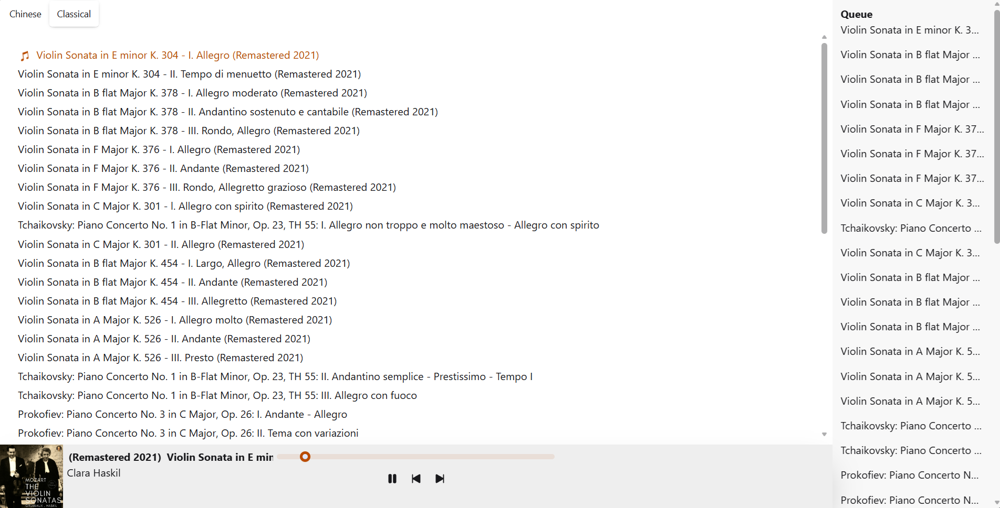

# Tsulemusic

A music player that serves music from your local directory.

## Building

Requirements:

1. MongoDB
2. Node.js

Install dependencies:

`npm install`

Modify `.env.example` and rename to `.env`

Build client:

`npm run build`

Start MongoDB (if necessary):

`systemctl start mongod`

Start server:

`npm run server`
